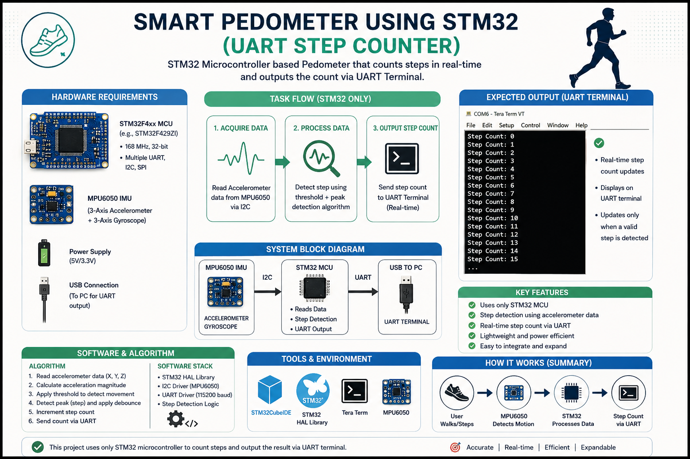

# 🚶‍♂️ Pedometer System (STM32 Embedded Firmware)

## 📌 Overview

This project implements a **pedometer (step-counting system)** on an STM32 microcontroller. It is designed to detect and count steps based on motion input, simulating or processing accelerometer-like signals in a real-time embedded environment.

The system demonstrates **embedded firmware design, real-time processing, and event detection**, making it relevant for wearable devices and fitness tracking applications.

<p align="center">
  
</p>

---

## ⚙️ Key Features

* ⏱️ Real-time step detection logic
* 🧩 Modular embedded firmware structure (HAL/CMSIS)
* 🔄 Interrupt/timer-based signal processing
* 📊 Configurable threshold-based step detection
* 🧵 Scalable for RTOS integration (if extended)
* 🛠️ Ready for sensor integration (accelerometer modules)

---

## 🧱 System Architecture

* **Microcontroller:** STM32 (e.g., STM32F4 series)
* **Framework:** STM32 HAL (Hardware Abstraction Layer)
* **Core Components:**

  * `main.c` – Application entry point
  * `stm32f4xx_it.c` – Interrupt handlers
  * `system_stm32f4xx.c` – System configuration
  * Peripheral drivers (timers/GPIO)

---

## 📂 Project Structure

```
Pedometer_Simulation/
│
├── Core/
│   ├── Inc/        # Header files
│   ├── Src/        # Application source code
│   └── Startup/    # Startup files
│
├── Drivers/
│   ├── CMSIS/      # ARM core support
│   └── STM32 HAL   # Hardware abstraction layer
│
├── .ioc            # STM32CubeMX configuration
├── linker.ld       # Memory configuration
```

---

## 🚀 How It Works

1. System initializes MCU and peripherals
2. Motion data (simulated or sensor-based) is processed
3. Signal is analyzed using threshold or pattern logic
4. Valid step events are detected
5. Step counter is updated in real-time

---

## 🛠️ How to Build & Run

### Requirements:

* STM32CubeIDE
* STM32 development board 

### Steps:

1. Open the `.ioc` file in STM32CubeIDE
2. Generate code (if needed)
3. Build the project
4. Flash to the board
5. Observe step count via debugger/serial output

---

## ⚠️ Limitations

* No real sensor input (if currently simulated)
* Accuracy depends on threshold tuning
* No advanced filtering or noise handling
